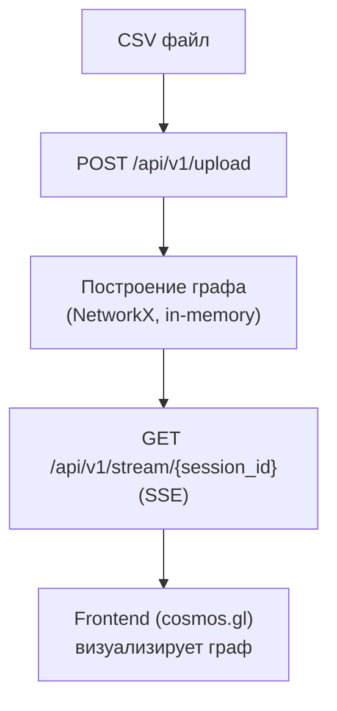

# AML Graph Visualizer (aml-graph)

## О проекте

**AML Graph Visualizer** - инструмент для финансовых следователей, позволяющий визуализировать транзакционные графы и
автоматически выявлять подозрительные паттерны отмывания денег.

Система анализирует структуру транзакций и выявляет такие сценарии, как циклы (layering), дробление платежей (smurfing),
транзитные узлы и использование общих устройств/IP.

Проект разработан в рамках дипломной работы (ДВФУ, ИМиКТ, 2026) и **не является production-решением** - это MVP для
демонстрации концепции анализа графов.

---

## Архитектура

Поток данных в системе:



- Все данные хранятся в памяти (in-memory)
- Персистентная база данных отсутствует
- Каждая загрузка создаёт отдельную сессию (UUID)

---

## Быстрый старт

### Требования

- Python 3.14+
- Node.js 24+
- Docker + Docker Compose
- uv
- npm
- GNU Make

---

### Вариант 1 - через Docker

```bash
make env
make build
make up
```

Приложение будет доступно:

- Backend: http://localhost:8000
- Frontend: http://localhost:3000

---

### Вариант 2 - локально (без Docker)

```bash
# Backend
cd backend
uv sync
uv run python -m src.main

# Frontend
cd frontend
npm install
npm run dev
```

---

## Формат входных данных

CSV файл должен содержать следующие поля:

### Обязательные

- sender_id - отправитель
- receiver_id - получатель
- amount - сумма
- timestamp - время (Unix или ISO 8601)

### Опциональные

- device_id
- ip_address

---

### Пример

```text
sender_id,receiver_id,amount,timestamp,device_id
C1,A2,1000,1710000000,D1
A2,A3,980,1710000500,D1
A3,C1,970,1710001000,D2
```

---

## Детекторы паттернов

### 1. Циклы (Layering)

Поиск простых циклов длиной 2–6:

- Малый промежуток времени Δt
- Высокая плотность потока ρ

ρ = total_weight / Δt

---

### 2. Дробление (Smurfing / Fan-out)

- Один отправитель
- Несколько получателей
- Похожие суммы
- Короткое временное окно

---

### 3. Транзитные узлы

- Высокая посредническая роль (betweenness centrality)
- Баланс входящих и исходящих средств

---

### 4. Общее устройство

- Несколько клиентов используют:
    - один device_id
    - один ip_address

---

## Скоринг риска

risk_score = σ(0.25 * degree + 0.40 * cycle_flag + 0.20 * balance_deviation + 0.15 * shared_device_flag)

σ(x) = 1 / (1 + e^(-x))

---

## TODO / Roadmap

## В работе / ближайший приоритет (MVP — 7–11 мая)

- [ ] Создание монорепозитория (backend + frontend)
- [ ] CSV Upload API (`/api/upload`) + парсинг через pandas
- [ ] Column Mapper (backend + frontend)
- [ ] Построение графа через NetworkX (DiGraph)
- [ ] Session storage (in-memory, UUID)
- [ ] SSE поток (`/api/stream`) с chunked graph delivery
- [ ] Детектор циклов (simple_cycles, 2–6)
- [ ] Fan-out detector (groupby sender)
- [ ] Risk scoring model:
    - degree
    - cycle flag
    - balance deviation
    - shared device signal
- [ ] Базовая интеграция cosmos.gl (рендер графа)
- [ ] Цвет узлов по risk_score / entity_type
- [ ] FileUploader + routing `/graph/[sessionId]`
- [ ] SSE client + progress UI
- [ ] DetailPanel (node attributes + risk breakdown)
- [ ] Sidebar фильтры по типам узлов

---

## Неделя 2 — основная функциональность (12–18 мая)

- [ ] Betweenness centrality (оптимизированная версия k-sampling)
- [ ] Размер узлов = risk_score mapping
- [ ] Толщина рёбер = transaction amount
- [ ] Shared device detector (device/ip → multi-client)
- [ ] Column mapping UI (frontend dropdown mapping schema)
- [ ] ForceAtlas2 layout (server-side precompute)
- [ ] SSE событие `layout_done` + координаты узлов
- [ ] Cosmos.gl: отключение симуляции, только render fixed layout
- [ ] Temporal slider (frontend filtering by timestamp)
- [ ] Graph state store (frontend cache, graph-store.ts)
- [ ] k-hop backend endpoint (`/api/khop`)
- [ ] k-hop frontend expand (incremental graph growth)
- [ ] Progress streaming для тяжёлых вычислений
- [ ] Оптимизация betweenness для больших графов (>50k)

---

## Функциональные улучшения (из плана работ, но в scope MVP)

- [ ] Единая схема risk model (документирование формулы)
- [ ] AMLSim integration (dataset 100k nodes)
- [ ] Stress test pipeline:
    - graph build
    - rendering
    - detectors
- [ ] FPS/latency profiling cosmos.gl
- [ ] Fallback стратегии:
    - ограничение k-hop
    - top-N degree nodes для betweenness
    - деградация визуализации при >100k nodes

---

## Вне scope MVP (исключено из 19-дневного плана)

- [ ] Aggregation / supernodes (setPointClusters)
- [ ] WCC segmentation pipeline
- [ ] Backend filtering endpoint `/api/filter`
- [ ] Graph Neural Networks (GNN)
- [ ] Kafka real-time streaming
- [ ] PostgreSQL / Redis persistence layer
- [ ] Multi-user collaboration mode
- [ ] SWIFT / банковские интеграции

---

## Неделя 3 — документация и сдача (19–26 мая)

- [ ] Генерация скриншотов интерфейса по мере разработки

### Курсовая (Руслан)

- [ ] Введение (AML context + 2–5% GDP risk)
- [ ] Упрощённая граф-модель
- [ ] Архитектура системы
- [ ] Практическая часть (UI + pipeline)
- [ ] Заключение

### Диплом (Дмитрий)

- [ ] Расширенная математическая модель
- [ ] Алгоритмы detection
- [ ] Архитектура и выбор технологий
- [ ] Апробация на AMLSim

---

## Финальная стадия

- [ ] End-to-end тестирование системы
- [ ] Проверка производительности (betweenness / SSE / render)
- [ ] Оптимизация узких мест
- [ ] Полировка UI (cosmos.gl стабильность)
- [ ] Проверка работы на AMLSim (100k+ транзакций)
- [ ] Финальная сборка проекта и фиксация версии

---

## Критические правила выполнения

- MVP должен быть полностью готов к **11 мая**
- новые фичи после 11 мая = только расширение, не блокер
- текст пишется параллельно разработке
- каждый день → минимум 1 артефакт (скрин / фича / описание)
- при перегрузе производительности → упрощаем алгоритм, а не добавляем инфраструктуру

---

## Команда

- Куторгин Руслан - Б9123-01.03.02сп
- Глобин Дмитрий - Б9122-01.03.02мкт

Тема: «Разработка визуализатора больших графов для финансовых следователей»

ДВФУ, ИМиКТ, 2026
