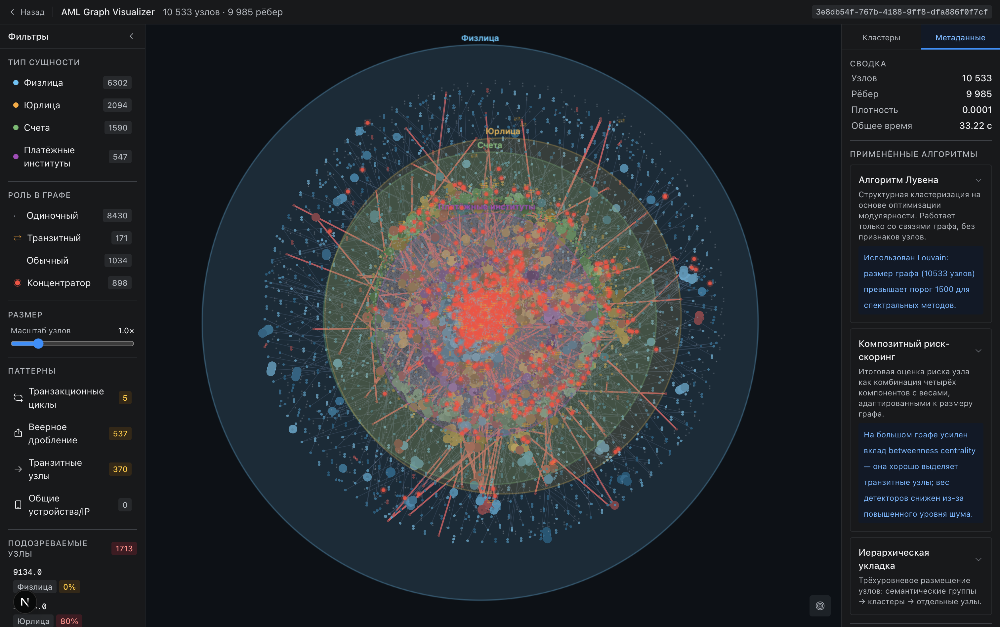
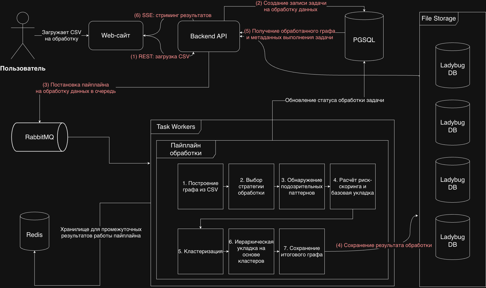

# AML Graph Visualizer (aml-graph)





## О проекте

**AML Graph Visualizer** - инструмент для финансовых следователей, позволяющий визуализировать транзакционные графы и
автоматически выявлять подозрительные паттерны отмывания денег.

Система анализирует структуру транзакций и выявляет такие сценарии, как циклы (layering), дробление платежей (smurfing),
транзитные узлы и использование общих устройств/IP.

Проект разработан в рамках дипломной работы (ДВФУ, ИМиКТ, 2026) и **не является production-решением** - это MVP для
демонстрации концепции анализа графов.

---

## Быстрый старт

### Требования

- Python 3.14+
- Node.js 24+
- Docker + Docker Compose
- uv
- npm
- GNU Make

---

### Запуск проекта

```bash
make env
make build
make up
make migrate DOCKER=1
```

Приложение будет доступно:

- Backend: http://localhost:9090
- Frontend: http://localhost:3000
- Redis: http://localhost:6379
- PostgreSQL: http://localhost:5432
- RabbitMQ: http://localhost:5432 (UI: http://localhost:15672)

---

## Команда

- Куторгин Руслан - Б9123-01.03.02сп
- Глобин Дмитрий - Б9122-01.03.02мкт

Тема: «Разработка визуализатора больших графов: инструмент финансового расследователя»

ДВФУ, ИМиКТ, 2026
